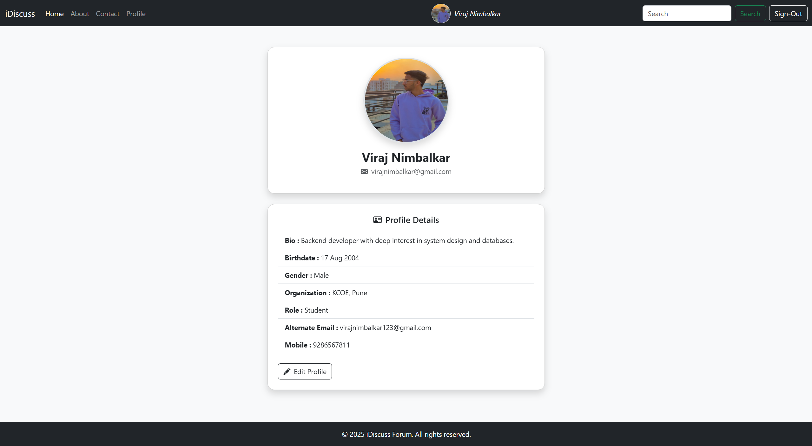
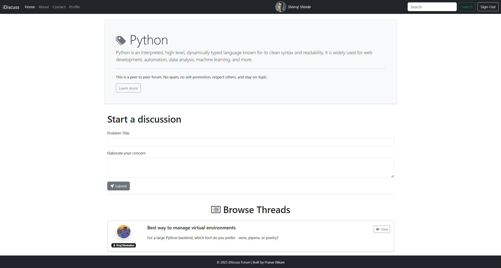
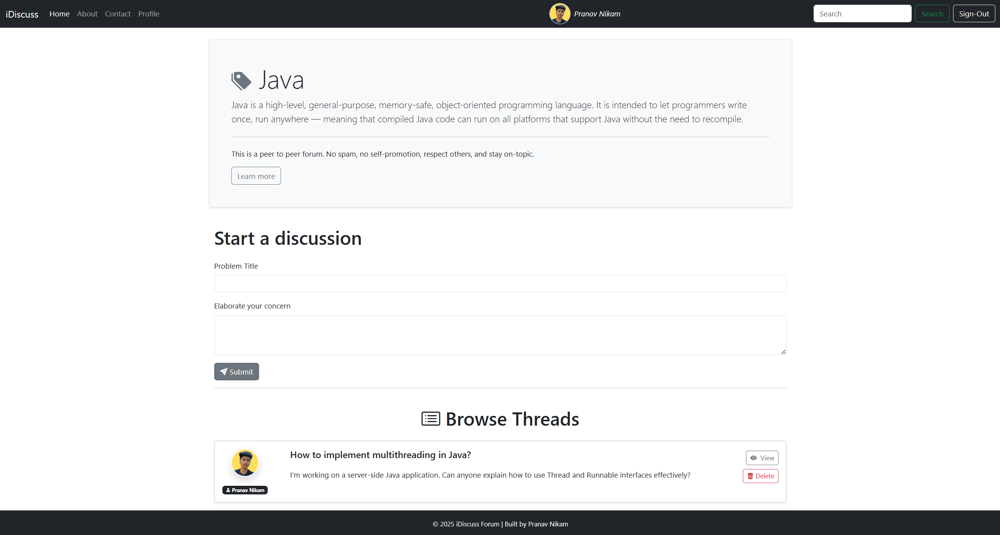
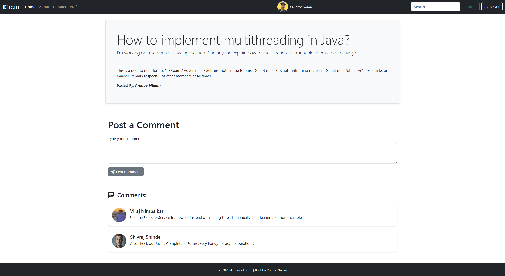
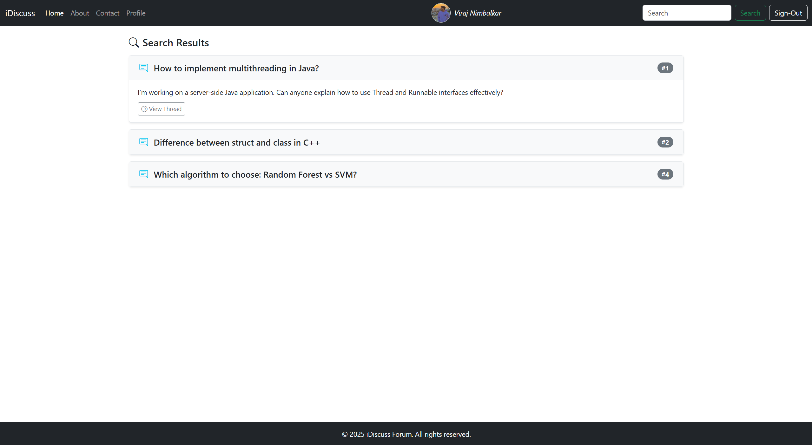
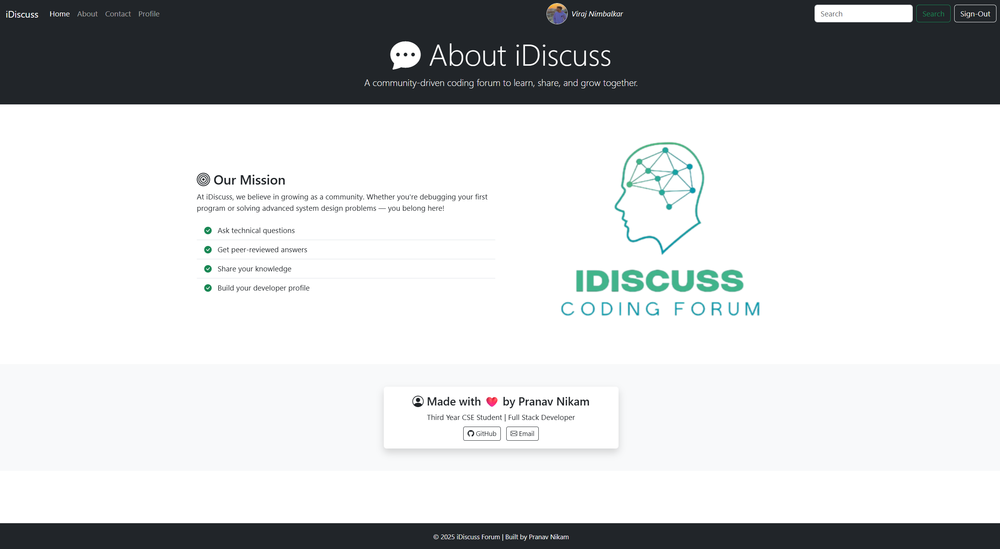

# 🚀 iDiscuss Forum

A full-stack **coding discussion forum** where users can register, create threads, comment, and maintain their personal profiles.  
Built using **Node.js**, **Express**, **MySQL**, and **Bootstrap**.

---

## 📌 Project Inspiration & Enhancements

This project is inspired by [CodeWithHarry](https://www.youtube.com/c/CodeWithHarry)'s iDiscuss Forum (PHP).  
I re-implemented the concept using a **Node.js** + **Express.js** backend with a **MySQL** database., and also added modern features like:

- 🔐 Users can upload a **profile photo**
- ✏️ Users can **edit full profile details** (bio, birthdate, gender, etc.)
- 🧵 **Users can post/delete** their own threads
- 💬 **Users can post/delete** their own comments  
> 🛡️ Only the **owner** of a thread or comment has the right to delete it.

## 🚀 Features

- 🧑‍💻 User registration, login, logout with session handling
- 🔐 Secure password hashing using `bcrypt`
- 📂 Categories to organize discussion topics
- 🧵 Post threads under categories
- 💬 Add comments to threads
- 👤 View and update user profile with:
  - Profile picture
  - Bio, Birthdate, Gender, Role, Mobile, Alternate Email
- 📷 Profile image upload using `multer`
- 📃 EJS templating for dynamic views

---

## 🛠️ Tech Stack

| Layer       | Technology                         |
|-------------|-------------------------------------|
| Frontend    | HTML, CSS, Bootstrap 5, EJS         |
| Backend     | Node.js, Express.js                 |
| Database    | MySQL with `mysql2` driver          |
| Auth & File | express-session, multer             |

---

## ⚙️ Set-Up Instructions

> Prerequisites :

- Node.js, MySQL installed and running locally.

### 1. Clone the Repository -

```bash
git clone https://github.com/PranavNikam-15/iDiscuss-Forum.git
cd iDiscuss-Forum
```

### 2. Install Node Dependencies -

```bash
npm install
```

### 3. Database Setup -

> 💡 See complete [Database Schema Description](./database.md)

```sql
-- Create the database
CREATE DATABASE idiscuss_project;
USE idiscuss_project;

-- USERS TABLE
CREATE TABLE users (
  user_id INT AUTO_INCREMENT PRIMARY KEY,
  user_name VARCHAR(50) NOT NULL,
  user_email VARCHAR(150) NOT NULL UNIQUE,
  user_password VARCHAR(255) NOT NULL,
  user_profile VARCHAR(255),
  bio TEXT,
  birthdate DATE,
  gender ENUM('Male', 'Female', 'Other') DEFAULT NULL,
  organization VARCHAR(100) DEFAULT NULL,
  role VARCHAR(50) DEFAULT NULL,
  alt_email VARCHAR(150) DEFAULT NULL,
  mobile VARCHAR(15) DEFAULT NULL,
  timestamp DATETIME DEFAULT CURRENT_TIMESTAMP
);

-- CATEGORIES TABLE
CREATE TABLE categories (
  id INT AUTO_INCREMENT PRIMARY KEY,
  name VARCHAR(35) NOT NULL,
  description TEXT NOT NULL,
  timestamp DATETIME DEFAULT CURRENT_TIMESTAMP
);

-- THREADS TABLE
CREATE TABLE threads (
  thread_id INT AUTO_INCREMENT PRIMARY KEY,
  thread_title VARCHAR(100) NOT NULL,
  thread_desc TEXT NOT NULL,
  thread_cat_id INT NOT NULL,
  thread_user_id INT,
  timestamp DATETIME DEFAULT CURRENT_TIMESTAMP,
  FULLTEXT(thread_title, thread_desc),
  FOREIGN KEY (thread_cat_id) REFERENCES categories(id),
  FOREIGN KEY (thread_user_id) REFERENCES users(user_id)
);

-- COMMENTS TABLE
CREATE TABLE comments (
  comment_id INT AUTO_INCREMENT PRIMARY KEY,
  comment_content TEXT NOT NULL,
  thread_id INT NOT NULL,
  comment_by INT NOT NULL,
  comment_time DATETIME DEFAULT CURRENT_TIMESTAMP,
  FOREIGN KEY (thread_id) REFERENCES threads(thread_id) ON DELETE CASCADE,
  FOREIGN KEY (comment_by) REFERENCES users(user_id) ON DELETE CASCADE
);
```

### 4. Configure Environment Variables -

> Create a .env file in the root directory of your project to store configuration values.

```env
# .env
DB_HOST=localhost
DB_USER=root
DB_PASSWORD=your_mysql_password
DB_NAME=idiscuss_project
SESSION_SECRET=Key
```

### 5. Run the App -

Start the server using:

```bash
node server.js
```
OR

```bash
nodemon server.js
```
> App will start on: http://localhost:8080

## 🖼️ Screenshots

### 🔐 Login Page


### 📝 Register Page


### 👤 Profile Page


### 🧵 Thread Lists
- **Thread List 1**  
  

- **Thread List 2**  
  

### 💬 Comments
- **Comment 1**  
  

- **Comment 2**  
  

### 🔍 Search Page


### 📄 About Page


## 📄 License

This project is licensed under the [MIT License](./LICENSE).
